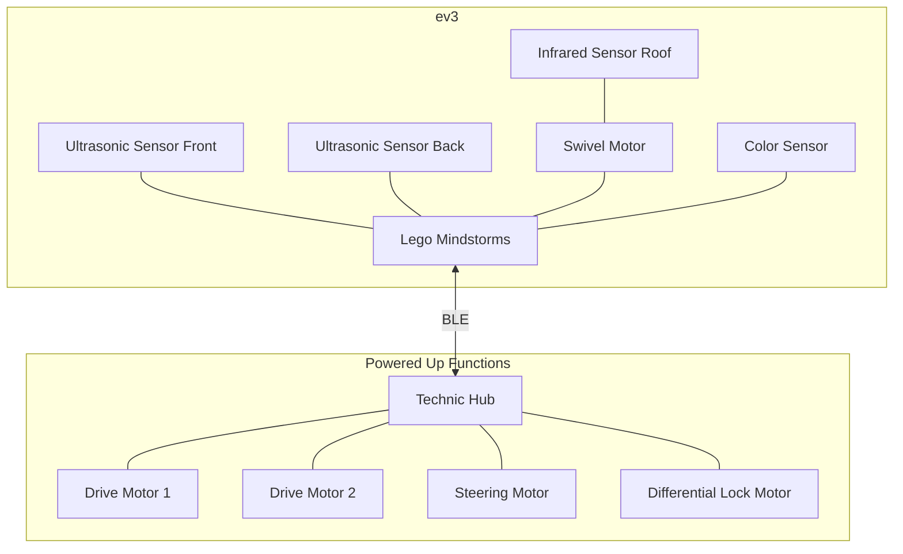

# Python application to control EV3 and Powered Up

The reason for writing this code is to have some fun with LEGO Mindstorms and to make my [Lego Zetros Trial Truck](https://www.lego.com/nl-nl/product/4x4-mercedes-benz-zetros-trial-truck-42129) drive itself around.

It turned out to be an interesting journey of discovery and a good way to brush up my Python skills :-)

My experimentation would not have been possible without a lot of help from other sources on the internet. See the [resources](#Resources) section at the end of this README for the list of links.

# System design

## Hardware

# Resources

| Resource                          | Description                                                                                                  | Usage                                                                                                                                                                                         |
|-----------------------------------|--------------------------------------------------------------------------------------------------------------|-----------------------------------------------------------------------------------------------------------------------------------------------------------------------------------------------|
| [ev3dev](https://www.ev3dev.org/) | Debian for the ev3. You can boot your ev3 with a full-featured Linux system.                                 | This is the basis on which I started. It unlocks the full potential of your ev3 and allows you to easily interact with it and develop in one of the many supported languages.                 |
| [LEGO BLE Wireless Protocol](https://lego.github.io/lego-ble-wireless-protocol-docs/index.html)| LEGO has published documentation for the protocol they have implemented for controlling the Powered Up hubs. | This is used as the basis to be able to decode and encode the messages to interact with the Powered Up system. See the [protocol](src/poweredup/protocol) folder for my implementation of it. |