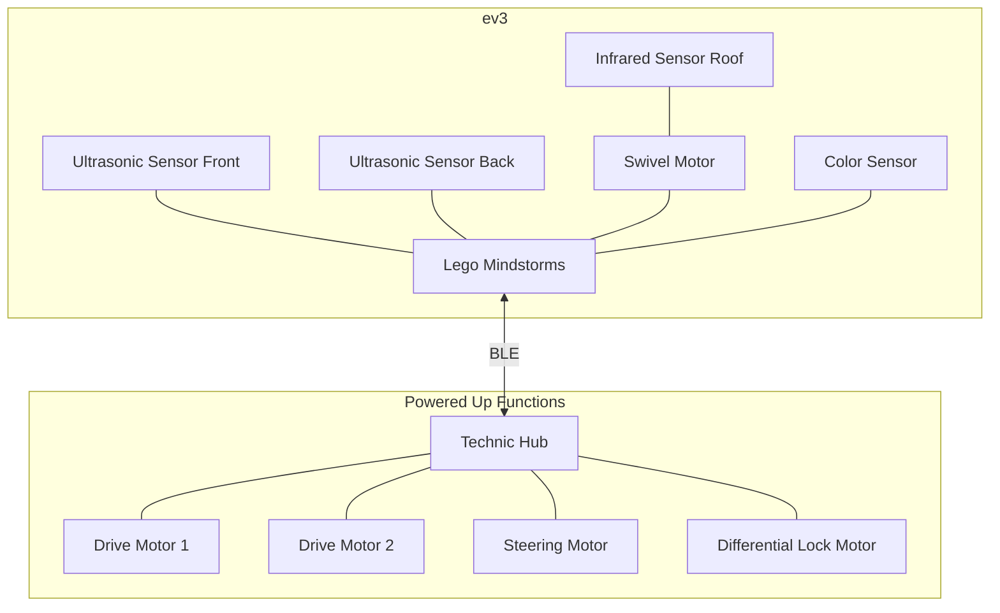

# Python application to control EV3 and Powered Up

The reason for writing this code is to have some fun with LEGO Mindstorms and to make my [Lego Zetros Trial Truck](https://www.lego.com/nl-nl/product/4x4-mercedes-benz-zetros-trial-truck-42129) drive itself around.

It turned out to be an interesting journey of discovery and a good way to brush up my Python skills :-)

My experimentation would not have been possible without a lot of help from other sources on the internet. See the [resources](#Resources) section at the end of this README for the list of links.

## System design

### Hardware

### Software

See:

* [LEGO Wireless BLE Protocol Implementation](src/poweredup/protocol)

## Setup

This is the record of how I have setup all of the components. I use python 3 on the ev3 by running [ev3dev](https://www.ev3dev.org/) on it.

The steps followed:
* Create an sd-card with [ev3dev](https://www.ev3dev.org/) on it.
* Pop it in the ev3 and watch the magic happen.
* My intelligence was insufficient to get the internal bluetooth adapter of the ev3 to talk to the Powered Up hub .... so I used my wallet to buy this: [Asus USB-BT500](https://www.amazon.com/ASUS-USB-BT500-Bluetooth-Backward-Compatible/dp/B08DFBNG7F)
* In my case I also have an usb-hub installed to be able to use both the wifi-dongle and bluetooth dongle at the same time.
* Next up was installing some software:
  * `sudo apt-get install python3-pip`
  * `sudo apt-get install libglib2.0-dev`
  * `sudo pip3 install bluepy`
* ... more to come ...

# Resources

| Resource                                                                                                 | Description                                                                                                  | Usage                                                                                                                                                                                         |
|----------------------------------------------------------------------------------------------------------|--------------------------------------------------------------------------------------------------------------|-----------------------------------------------------------------------------------------------------------------------------------------------------------------------------------------------|
| [ev3dev](https://www.ev3dev.org/)                                                                        | Debian for the ev3. You can boot your ev3 with a full-featured Linux system.                                 | This is the basis on which I started. It unlocks the full potential of your ev3 and allows you to easily interact with it and develop in one of the many supported languages.                 |
| [LEGO BLE Wireless Protocol](https://lego.github.io/lego-ble-wireless-protocol-docs/index.html)          | LEGO has published documentation for the protocol they have implemented for controlling the Powered Up hubs. | This is used as the basis to be able to decode and encode the messages to interact with the Powered Up system. See the [protocol](src/poweredup/protocol) folder for my implementation of it. |
| [bluepy](https://github.com/IanHarvey/bluepy) + [documentation](https://ianharvey.github.io/bluepy-doc/) | Library for using ble in Python                                                                              | This is the library I use to send and receive the bluetooth messages for controlling the Technic Hub                                                                                          |
| [Asus USB-BT500](https://www.amazon.com/ASUS-USB-BT500-Bluetooth-Backward-Compatible/dp/B08DFBNG7F)      | Bluetooth ble compatible adapter.                                                                            | Used to control the Technic Hub from the ev3                                                                                                                                                  |
| [Bleak](https://bleak.readthedocs.io/en/latest/) | Bleutooth Low Enegy platform Agnostik Klient                                                                 | Bluetooth low energy library for python.                                                                                                                                                      |

## Information used along the way

- https://github.com/ev3dev/ev3dev-lang-python-demo
- [https://docs.ev3dev.org/projects/lego-linux-drivers/en/ev3dev-jessie/sensors.html#id36](https://docs.ev3dev.org/projects/lego-linux-drivers/en/ev3dev-jessie/sensors.html#id36)
- https://github.com/ev3dev/ev3dev-lang-python
- [https://ev3dev-lang.readthedocs.io/projects/python-ev3dev/en/ev3dev-stretch/index.html](https://ev3dev-lang.readthedocs.io/projects/python-ev3dev/en/ev3dev-stretch/index.html)
- [https://github.com/undera/pylgbst/blob/master/pylgbst/comms/cbluepy.py](https://github.com/undera/pylgbst/blob/master/pylgbst/comms/cbluepy.py)
- [https://ianharvey.github.io/bluepy-doc/](https://ianharvey.github.io/bluepy-doc/)
- https://github.com/virantha/bricknil
- https://github.com/oscaracena/pygattlib
- [https://wiki.python.org/moin/BitManipulation](https://wiki.python.org/moin/BitManipulation)
- [https://docs.python.org/3/library/stdtypes.html](https://docs.python.org/3/library/stdtypes.html)
- [https://geektechstuff.com/2020/06/01/python-and-bluetooth-part-1-scanning-for-devices-and-services-python/](https://geektechstuff.com/2020/06/01/python-and-bluetooth-part-1-scanning-for-devices-and-services-python/)
- [https://docs.python.org/3/library/asyncio.html](https://docs.python.org/3/library/asyncio.html)
- [pyb00st](https://github.com/JorgePe/pyb00st)
- Lego Powered Up control from Node: [https://github.com/nathankellenicki/node-poweredup/](https://github.com/nathankellenicki/node-poweredup/)
- Expected part of powered up hub - [https://rebrickable.com/parts/22127/hub-powered-up-4-port-technic-control-clip-opening/](https://rebrickable.com/parts/22127/hub-powered-up-4-port-technic-control-clip-opening/)
- PyBricks [https://pybricks.com](https://pybricks.com/)
- PyBricks Q&A [https://www.eurobricks.com/forum/index.php?/forums/topic/186132-pybricks-qa/](https://www.eurobricks.com/forum/index.php?/forums/topic/186132-pybricks-qa/)
- EV3 Dev [https://www.ev3dev.org/docs/getting-started/](https://www.ev3dev.org/docs/getting-started/)
- Hub aansturen / bluetooth hacking https://github.com/ev3dev/ev3dev/issues/521
- Bluetooth protocol [https://lego.github.io/lego-ble-wireless-protocol-docs/index.html#document-index](https://lego.github.io/lego-ble-wireless-protocol-docs/index.html#document-index) and https://github.com/LEGO/lego-ble-wireless-protocol-docs
- C# implementation to control the hub https://github.com/sharpbrick/powered-up
- Arduino hardware [https://create.arduino.cc/projecthub/haraldholzner/bluetooth-remote-control-for-lego-technic-hub-6ef303](https://create.arduino.cc/projecthub/haraldholzner/bluetooth-remote-control-for-lego-technic-hub-6ef303)
- Lego Powered Up documenation [https://www.eurobricks.com/forum/index.php?/forums/topic/168975-documenting-the-lego-poweredup-system/](https://www.eurobricks.com/forum/index.php?/forums/topic/168975-documenting-the-lego-poweredup-system/)
- [Lego Powered Up Documentation](https://www.notion.so/Lego-Powered-Up-Documentation-a6e2111d78484bc181c01cf8ec36e09a)
- Python [https://sites.google.com/site/ev3devpython/](https://sites.google.com/site/ev3devpython/)
- Share internet over bluetooth [https://computersluggish.com/windows-tutorials/desktop/how-to-share-your-internet-over-bluetooth-in-windows-10/](https://computersluggish.com/windows-tutorials/desktop/how-to-share-your-internet-over-bluetooth-in-windows-10/)
- Remote C# for EV3 [http://www.monobrick.dk/software/monobrick/](http://www.monobrick.dk/software/monobrick/)
- .Net 6 [https://docs.microsoft.com/en-us/dotnet/core/install/linux](https://docs.microsoft.com/en-us/dotnet/core/install/linux)
- Nanoframework .Net for embedded [https://www.nanoframework.net](https://www.nanoframework.net/)
- lego sdk’s [https://www.lego.com/en-us/themes/mindstorms/downloads](https://www.lego.com/en-us/themes/mindstorms/downloads)
- lego engineering site [http://www.legoengineering.com/ev3-sensors/](http://www.legoengineering.com/ev3-sensors/)
- lego ev3 api .net https://github.com/BrianPeek/legoev3
- .net installation on debian [https://docs.microsoft.com/en-us/dotnet/core/install/linux-debian](https://docs.microsoft.com/en-us/dotnet/core/install/linux-debian)
- .net installation script [https://docs.microsoft.com/en-us/dotnet/core/tools/dotnet-install-script](https://docs.microsoft.com/en-us/dotnet/core/tools/dotnet-install-script)
- Bluetooth linux [https://www.jaredwolff.com/get-started-with-bluetooth-low-energy/#get-acquainted-with-the-tools](https://www.jaredwolff.com/get-started-with-bluetooth-low-energy/#get-acquainted-with-the-tools)
- Moar bluetooth [https://reverse-engineering-ble-devices.readthedocs.io/en/latest/script_creation/00_script_creation.html](https://reverse-engineering-ble-devices.readthedocs.io/en/latest/script_creation/00_script_creation.html)
- EV3 Powered Up (https://www.youtube.com/watch?v=RFHCahxJdAM)
- BT LE support for ev3 - https://github.com/ev3dev/ev3dev/issues/711